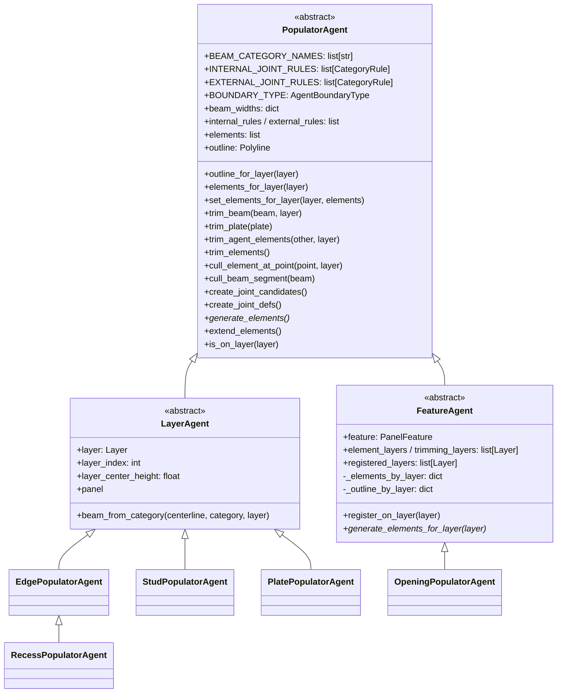
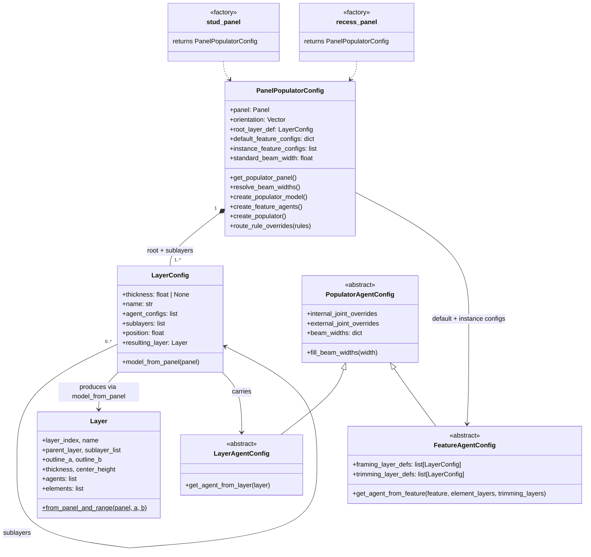
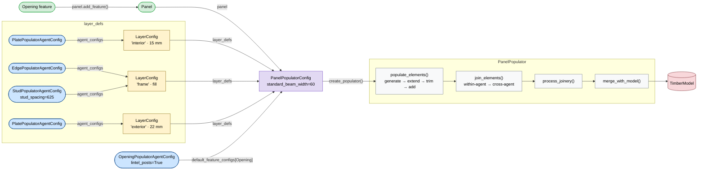
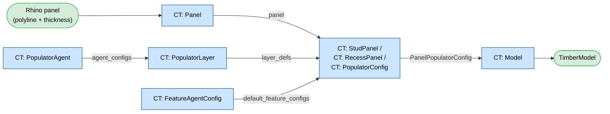

# Panel populator subsystem — layered framing, per-agent overrides, GH workflow

## Summary

This PR rewrites the wall-populator as a generic, layer-based **panel populator**:

- A panel is described by an ordered list of **`LayerConfig`** blueprints (with optional nested `sublayers`).
- Each layer holds **agent configs** that produce framing elements (`LayerAgentConfig`) or react to panel features such as openings (`FeatureAgentConfig`).
- **`PanelPopulatorConfig`** ties it all together and produces a **`PanelPopulator`** that runs a fixed generate → extend → trim → join → process → merge pipeline.
- Two convenience factories — **`stud_panel()`** and **`recess_panel()`** — wire up the common framing systems.
- A new **GH workflow** exposes the whole thing: `CT: PopulatorLayer`, `CT: PopulatorAgent`, `CT: FeatureAgentConfig`, `CT: StudPanel`, `CT: RecessPanel`, `CT: PopulatorConfig` → `CT: Model`.

The intent is to (a) give a single, composable model for any panel cross-section we're likely to need (multi-layer walls, recessed panels, nested insulation cores, etc.), (b) keep the per-pair behaviour of the joint solver where each agent can have its own overrides, and (c) make Grasshopper feel like data flowing through configs into a populator, not like a wall of script.

A fuller migration guide and a complete worked example live in `docs/user_guide/populating_panels.md`; the contributor-facing diagrams are in `docs/contribution/class_diagrams.md`.

---

## Architecture

### Agent hierarchy



Key shape of the base:

- The `_trim_layers()` hook drives a single, concrete `trim_elements()` on the base class. `LayerAgent` returns `[self.layer]`; `FeatureAgent` returns `element_layers + trimming_layers`. No per-subclass trim override is needed.
- `outline_for_layer(layer)` returns `self.outline` for layer agents and the per-layer boundary for feature agents, so trimming/culling on a given layer uses the correct boundary even when the feature frames on several layers.
- `EdgePopulatorAgent._edge_joint_rule` picks between the geometric miter/butt logic (for sloped edges that need bevel-aware cut planes) and the rule-based path (for perpendicular edges, so `internal_joint_overrides` take effect).

### Configs and the top-level orchestrator



### Pipeline / user workflow



In Python this collapses to:

```python
config = stud_panel(
    panel=panel,
    standard_beam_width=60,
    stud_spacing=625,
    sheeting_inside=15,
    sheeting_outside=22,
    default_feature_configs={
        Opening: OpeningPopulatorAgentConfig(lintel_posts=True, header_width=120),
    },
)
populator = config.create_populator()
populator.populate_elements()
populator.join_elements()
populator.process_joinery()
populator.merge_with_model(model)
```

---

## Joint-rule overrides

Two complementary surfaces:

1. **Per-agent overrides** — every agent config carries `internal_joint_overrides` and `external_joint_overrides`. These are merged into `INTERNAL_JOINT_RULES` / `EXTERNAL_JOINT_RULES` at agent construction time. The merge keys on **(SUPPORTED_TOPOLOGY, categories)**, so the same `(stud, top_plate_beam)` pair can carry both a `TButtJoint` and an `LButtJoint` — they target different cluster topologies and both survive.
2. **Panel-level routing** — `PanelPopulatorConfig.route_rule_overrides(rules)` (also exposed as the `joint_rule_overrides` argument on `stud_panel()` / `recess_panel()`) dispatches each `CategoryRule` to whichever agents own its categories — both categories on one agent → that agent's `internal_joint_overrides`; one category on each of two agents → both agents' `external_joint_overrides`; neither → skipped. Callers don't need to know which agent owns each pair.

Cross-agent precedence is solved at solve time: `PanelPopulator.create_cross_agent_joints` prepends both agents' *raw* `external_overrides` ahead of their merged rule lists, so a per-agent override always wins against the other agent's base rule for the same pair, regardless of agent ordering.

---

## GH workflow



`CT: StudPanel` / `CT: RecessPanel` are the friendly entry points for the two common framing systems; `CT: PopulatorConfig` is the escape hatch for fully custom layer stacks built from `CT: PopulatorLayer` + `CT: PopulatorAgent` + `CT: FeatureAgentConfig`.

---

## Notable bug fixes & gotchas worth a reviewer's eye

- **Shared-state bug in `stud_panel()`.** The factory used to mutate the caller-supplied `OpeningPopulatorAgentConfig`'s `framing_layer_defs` / `trimming_layer_defs` in place. When `CT: StudPanel` ran across a list of panels (or several `CT: StudPanel` components shared the same upstream `CT: FeatureAgentConfig`), the *last* call's `LayerConfig` references would win and earlier panels' opening agents pointed at layers whose `resulting_layer` was never set, eventually crashing in `_create_frame_polylines` with `'NoneType' object has no attribute 'planes'`. `stud_panel()` now shallow-copies the dict and the opening config before injecting the layer references.
- **`find_beam_outline_crossings` desync.** The boundary-coincident-crossing filter in step 1 could leave `current_entry` as `None` while the inside/outside walker still thought it was inside, crashing with `'NoneType' object has no attribute 'internal_dots'` on non-convex outlines (opening frames, in particular). The loop now opens a fresh wrap-around entry on demand.
- **Same-layer trim scoping.** `LayerAgent.trim_elements()` only ever touches `agent.elements_for_layer(self.layer)`, so a layer agent can never cut framing on a different layer. The opening agent's `extend_elements` was rebuilt to be strictly per-layer for the same reason.
- **Per-layer outlines on feature agents.** Multi-layer features previously left a single `self.outline` that was overwritten per layer iteration, so trimming/culling on every layer except the last used the wrong boundary. Now stored per layer via `_outline_by_layer` and resolved through `outline_for_layer(layer)`.

---

## Migration notes

For users coming from the previous `stud_panel()` signature:

- `lintel_posts`, `split_bottom_plate_beam`, `header_width`, `sill_width`, `king_stud_width`, `jack_stud_width` → moved to `OpeningPopulatorAgentConfig`, passed via `default_feature_configs[Opening]` (or `instance_feature_configs`).
- `beam_width_overrides={"header": 120, ...}` → set on the relevant agent config directly (e.g. `OpeningPopulatorAgentConfig(header_width=120)`).
- `edge_beam_min_width` → removed; explicit per-category widths cover this.
- `joint_rule_overrides` is still accepted as a flat list at the panel level, and is now dispatched via `route_rule_overrides`.
- `is_framing_layer` on `LayerConfig` → removed; feature configs name their layers via `framing_layer_defs` / `trimming_layer_defs` (the factories wire these up automatically).
- `create_populator_from_panel(panel)` → set `config.panel = panel` (or pass `panel=` to the factory) and call `config.create_populator()`.

---

## Testing

- `tests/test_populators.py` — agent factories, layer-config tree, `TestRouteRuleOverrides` for the new rule-routing.
- `tests/test_panel_populator_workflow.py` — end-to-end stud-wall / opening / recess / multi-panel / sheathing scenarios.
- `tests/test_connection_solver_2d.py` — pairwise topology classifier.
- `tests/test_agent_intersection.py` — `find_beam_outline_crossings` and `extend_beam_to_closest_agents`.
- All modified module files byte-compile cleanly. The suite has not been run end-to-end in this environment — please run `pytest tests/` against your usual venv (`compas_timber` + `Opening` available) before approving.

---

## Out of scope / follow-ups discussed but not in this PR

- **Occlusion-aware perimeter walk in `ConnectionSolver2D`** — design landed in a discussion thread (`find_beam_contacts` / `Beam2DCluster` + port/union-find clustering + role-based Y/K topology), to be implemented in a follow-up PR. Until then the new `LButtJoint` external rules on `StudPopulatorAgent` act as a hack for the "stud meets edge corner" case.
- **Wildcard `*` category + N-ary `CategoryRule`** — sketched in the same thread, on the table once a real Y/K joint is needed.
