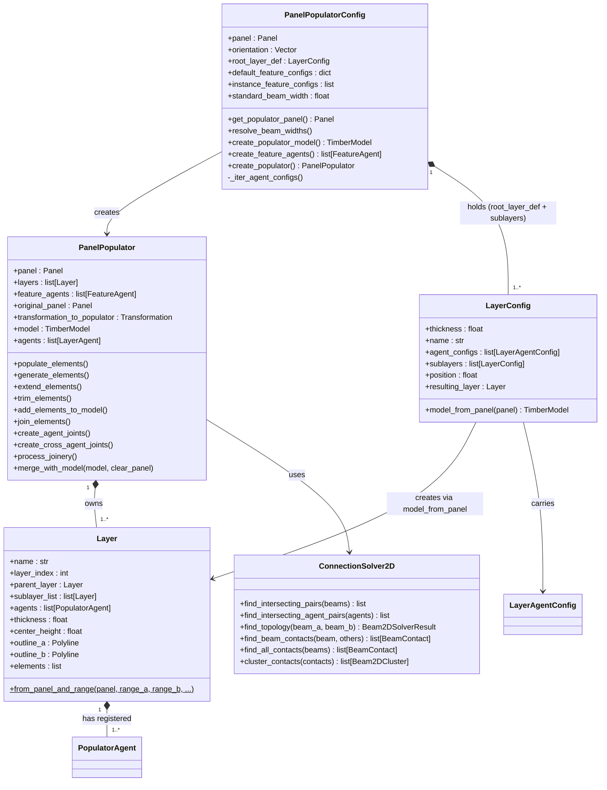
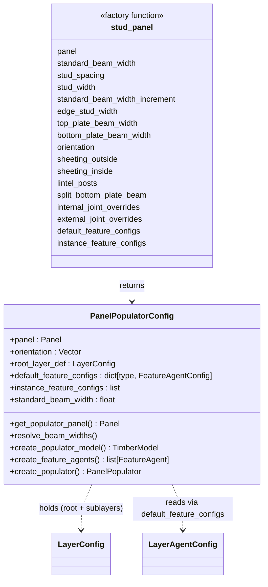
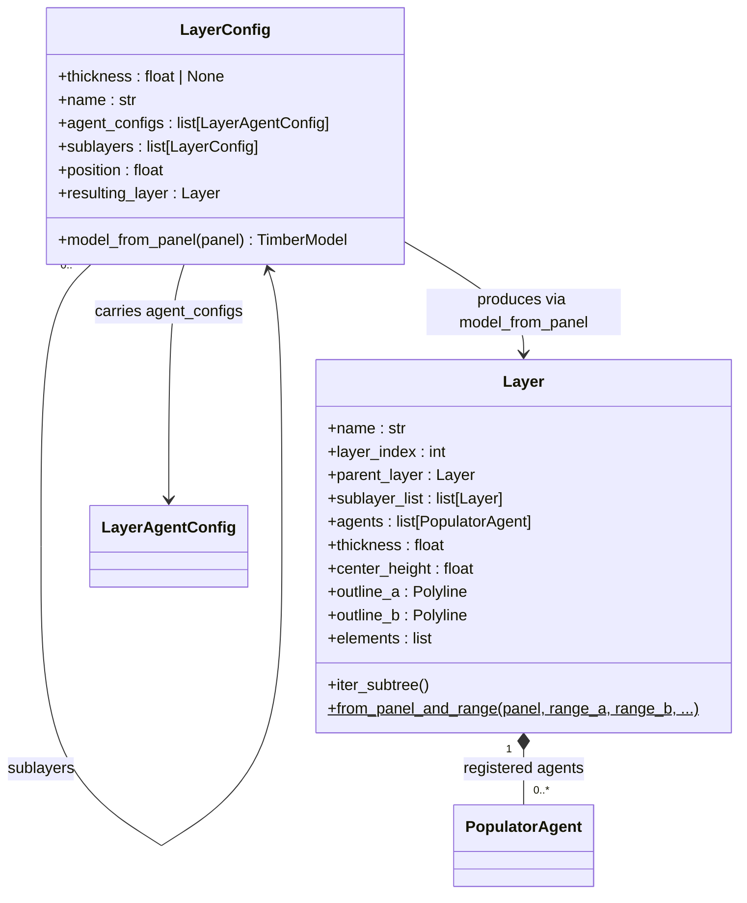
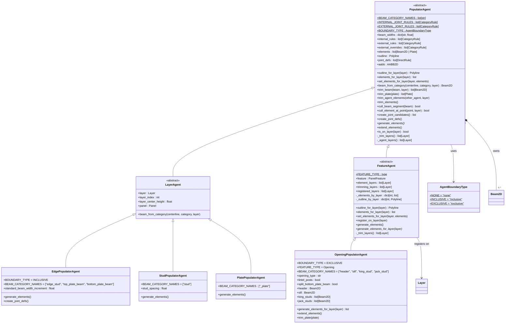
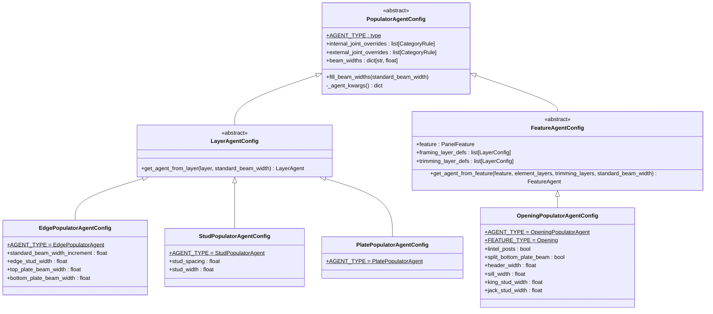
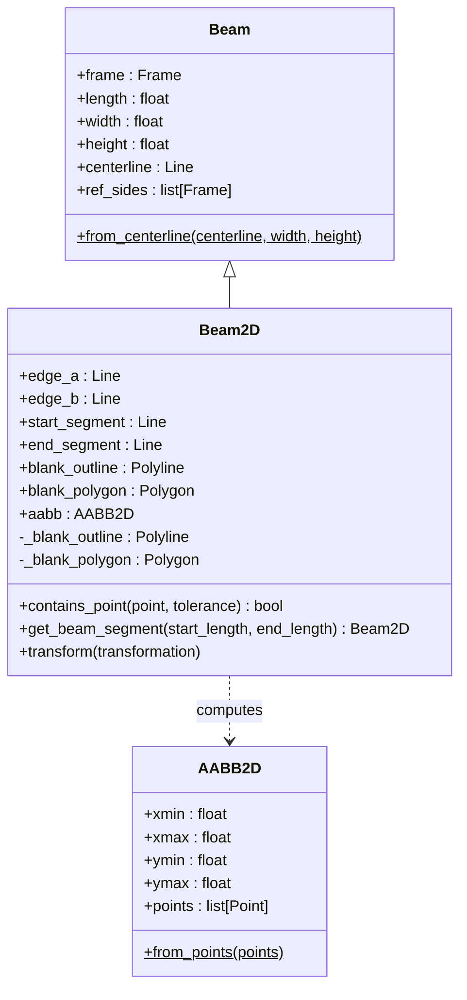
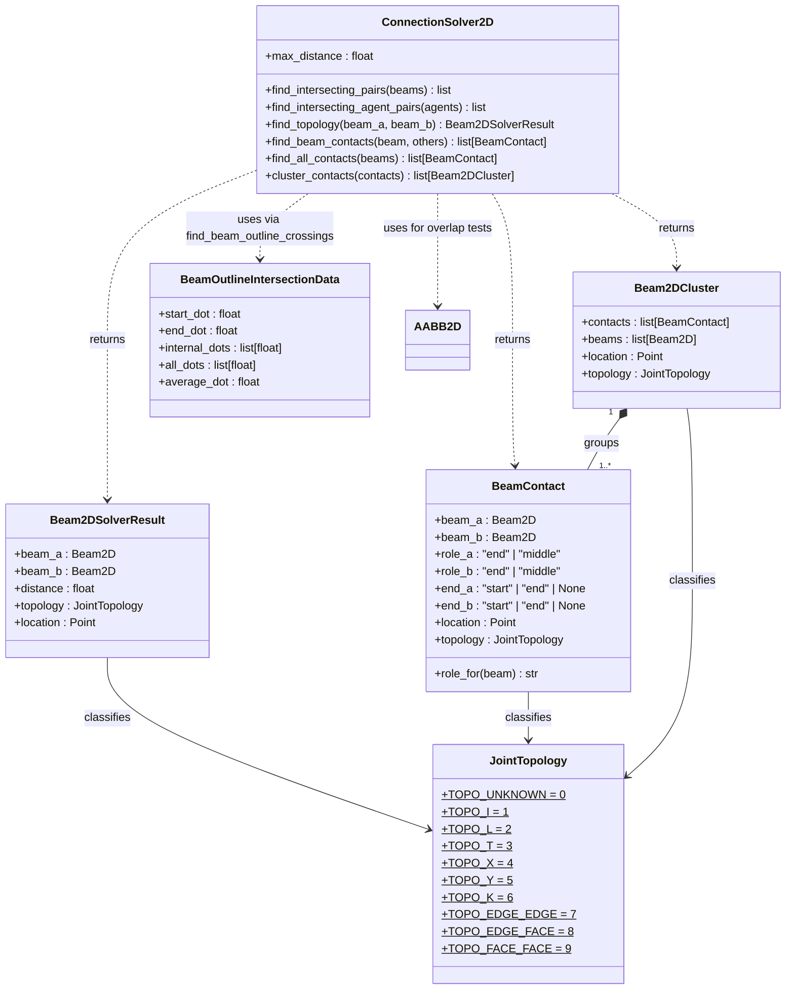

# Class Diagrams

This section provides visual representations of the class hierarchies and relationships in the `timber_design` package.

[TOC]

## Populators Subsystem

### Orchestration

`PanelPopulatorConfig` holds all parameters for one panel type, resolves the layer stack from `LayerConfig` blueprints, and produces a ready-to-use `PanelPopulator`.

---

### Populator Config Factories

`PanelPopulatorConfig` is the single concrete config class.  The
`stud_panel()` **factory function** (not a subclass) builds the right
`LayerConfig` stack and agent configs for a standard stud-framed wall panel
and returns a `PanelPopulatorConfig`.  Custom configs are made by
instantiating `PanelPopulatorConfig` directly with a `layer_defs` list.

---

### Layer and LayerConfig

`LayerConfig` is a pure data blueprint with no geometry.  `Layer` is the
resolved runtime object — it *is* a `Panel` (sliced from the source panel) and
also holds the list of agents registered on it.  The definition tree supports
nested `sublayers` for composite cross-sections; `thickness=None` on a leaf
causes fill-remaining resolution against the parent.

There is **no** `is_framing_layer` flag.  Feature agents (openings, etc.) point
at the specific layers they frame on via `framing_layer_defs` on their config,
and at the layers they trim through via `trimming_layer_defs`.

---

### Populator Agents

`PopulatorAgent` is the abstract base.  `LayerAgent` and `FeatureAgent` are the
two specializations — `LayerAgent` is bound to exactly one `Layer`,
`FeatureAgent` spans multiple layers (e.g. an opening that frames on one or
more framing layers and cuts through sheathing layers).

The base owns the common element / outline / trim machinery so the subclasses
declare only what differs — `LayerAgent` adds nothing more than its single
`layer` reference and a `beam_from_category` convenience; `FeatureAgent` swaps
the flat element list for a per-layer bucket and a per-layer outline.

---

### Agent Configs

Each agent subclass has a matching config dataclass.  All configs descend from
`PopulatorAgentConfig`, which carries the per-agent joint-rule overrides (split
into `internal_joint_overrides` and `external_joint_overrides`) and the
`beam_widths` dict.  Subclasses add **explicit per-category width fields**
(`edge_stud_width`, `stud_width`, `header_width`, …) rather than a generic
overrides dict; `_agent_kwargs()` is the single seam that turns config fields
into the agent's explicit constructor keyword arguments.

---

### 2D Geometry

`Beam2D` extends compas_timber's `Beam` with a lazy 2D blank outline used for
all intersection and topology detection operations. `AABB2D` is a lightweight
2D bounding box that avoids the `ZeroDivisionError` that `compas.geometry.Box`
raises on flat z=0 geometry.

---

### Connection Solver and Intersection Utilities

`ConnectionSolver2D` offers two complementary detection paths:

- the legacy pairwise `find_topology(beam_a, beam_b)` using blank-corner
  containment + edge crossings; and
- an occlusion-aware perimeter walk — `find_beam_contacts(beam, others)` —
  which records the *role* (end vs middle) of each beam at every real contact
  and discards beams hidden behind a nearer one.  `cluster_contacts` then
  groups those contacts on shared **ports** (a beam's end key, or overlapping
  intervals along its long face) into `Beam2DCluster` objects whose topology
  is derived from per-beam roles (Y when every beam meets at an end, K when
  at least one is met through its middle).

`BeamOutlineIntersectionData` stores the entry/exit dot positions where an
outline crosses a beam blank, used by `trim_beam` to split beams at agent
boundaries.

