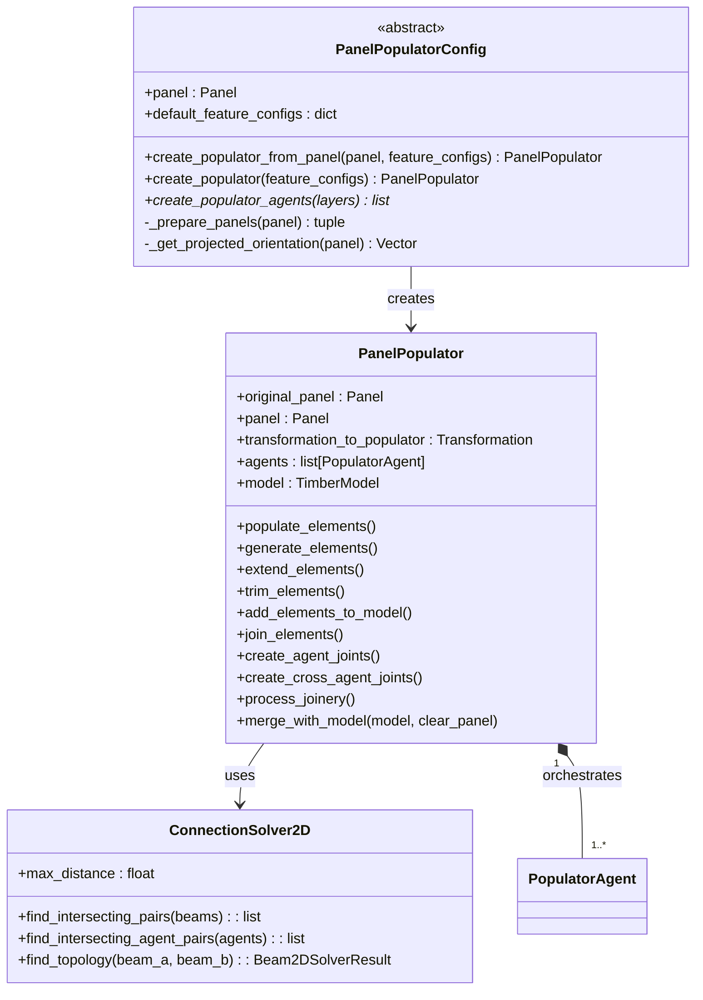
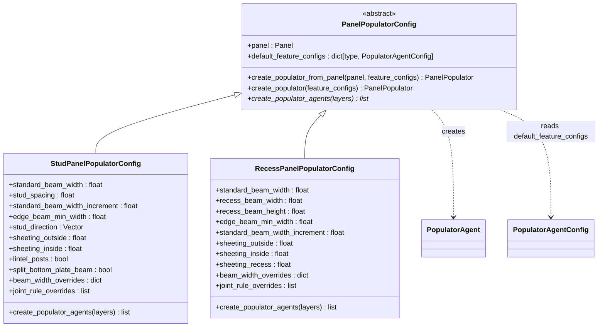
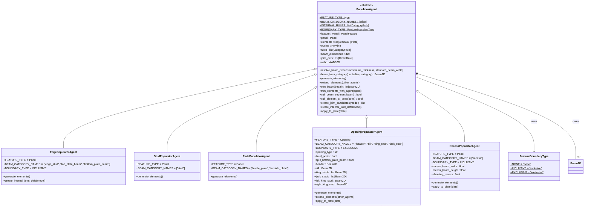
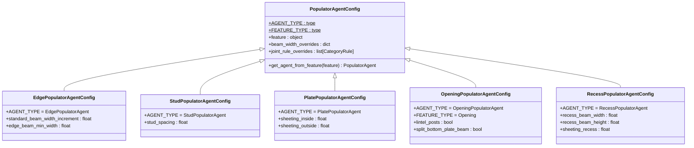
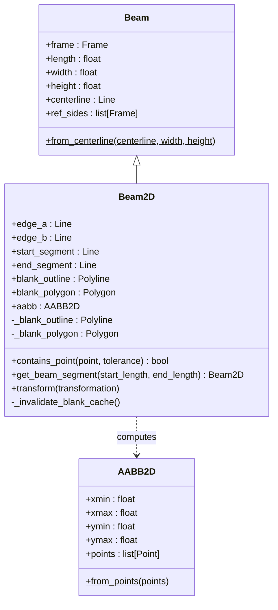
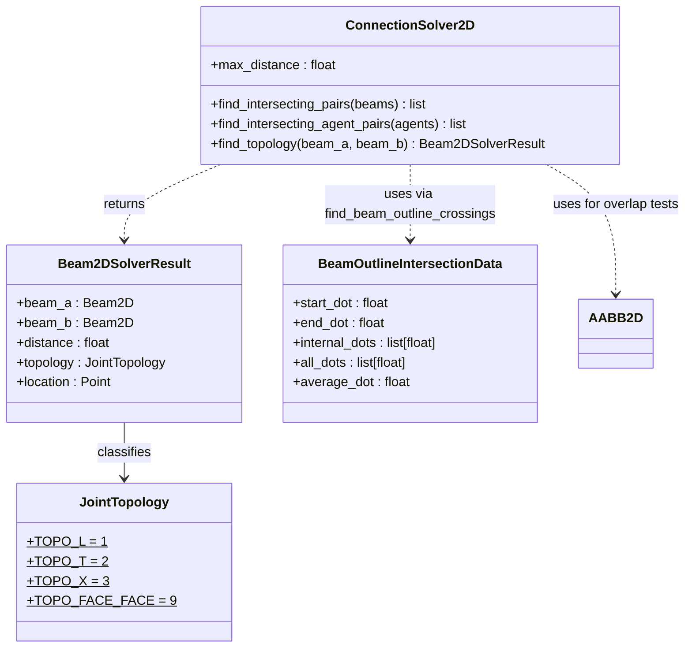

# Class Diagrams

This section provides visual representations of the class hierarchies and relationships in the `timber_design` package.

[TOC]

## Populators Subsystem

### Orchestration

`PanelPopulatorConfig` combines configuration data and factory behaviour into a single object.
Call `create_populator(panel)` to get a ready-to-use `PanelPopulator`.

---

### Populator Configs

Each concrete config subclass holds all parameters for one panel type and implements
`create_populator_agents`.  `default_feature_configs` maps panel-feature types to
`PopulatorAgentConfig` instances (no `feature` set) for automatic per-feature agent
creation using MRO-based lookup.

---

### Populator Agents

Each `PopulatorAgent` subclass is responsible for one logical group of framing elements.
The abstract base class defines the trimming, extending, and joint-creation interface.
Every concrete agent declares the feature class it handles via `FEATURE_TYPE`.

---

### Agent Configs

Each `PopulatorAgent` subclass has a matching `PopulatorAgentConfig` dataclass.
`AGENT_TYPE` is set after both classes are defined to avoid forward references.
The `feature` field and `get_agent_from_feature` method allow the config to act
as a factory for its associated agent.

---

### 2D Geometry

`Beam2D` extends compas_timber's `Beam` with a lazy 2D blank outline used for all intersection and topology detection operations. `AABB2D` is a lightweight 2D bounding box that avoids the `ZeroDivisionError` that `compas.geometry.Box` raises on flat z=0 geometry.

---

### Connection Solver and Intersection Utilities

`ConnectionSolver2D` uses blank-outline endpoint containment to classify beam pairs into L, T, X, or face-to-face topologies. `BeamOutlineIntersectionData` stores the entry/exit dot positions where an agent outline crosses a beam blank, used by `trim_beam` to split beams at agent boundaries.

