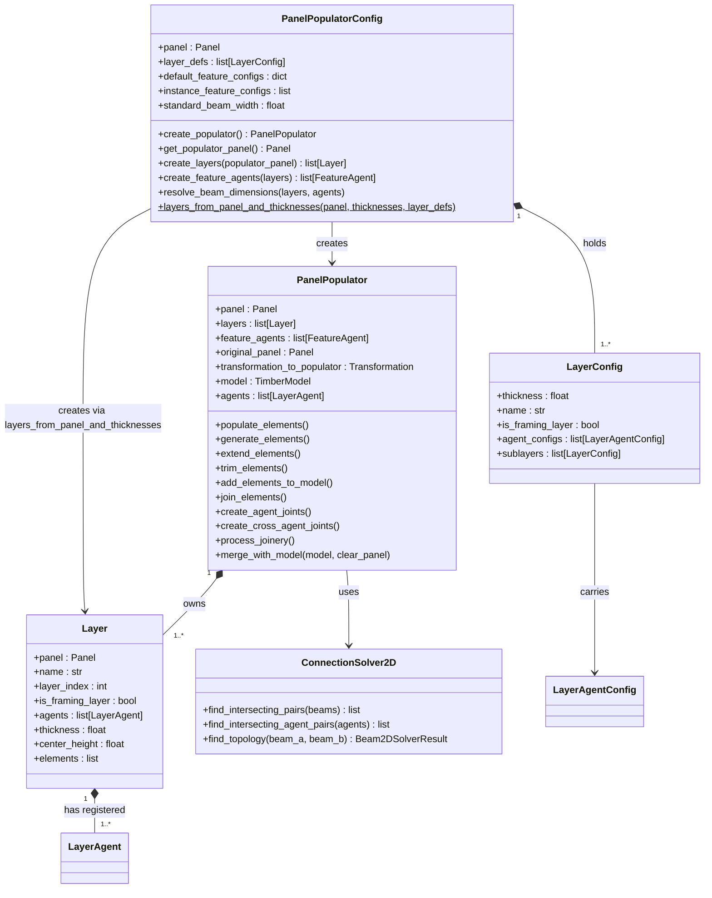
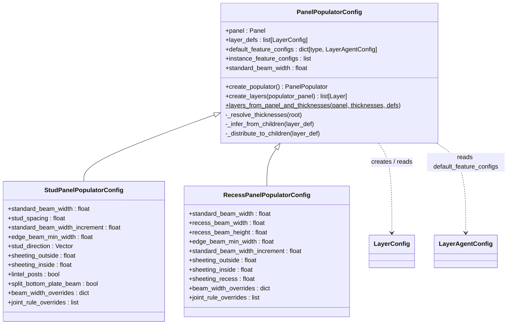
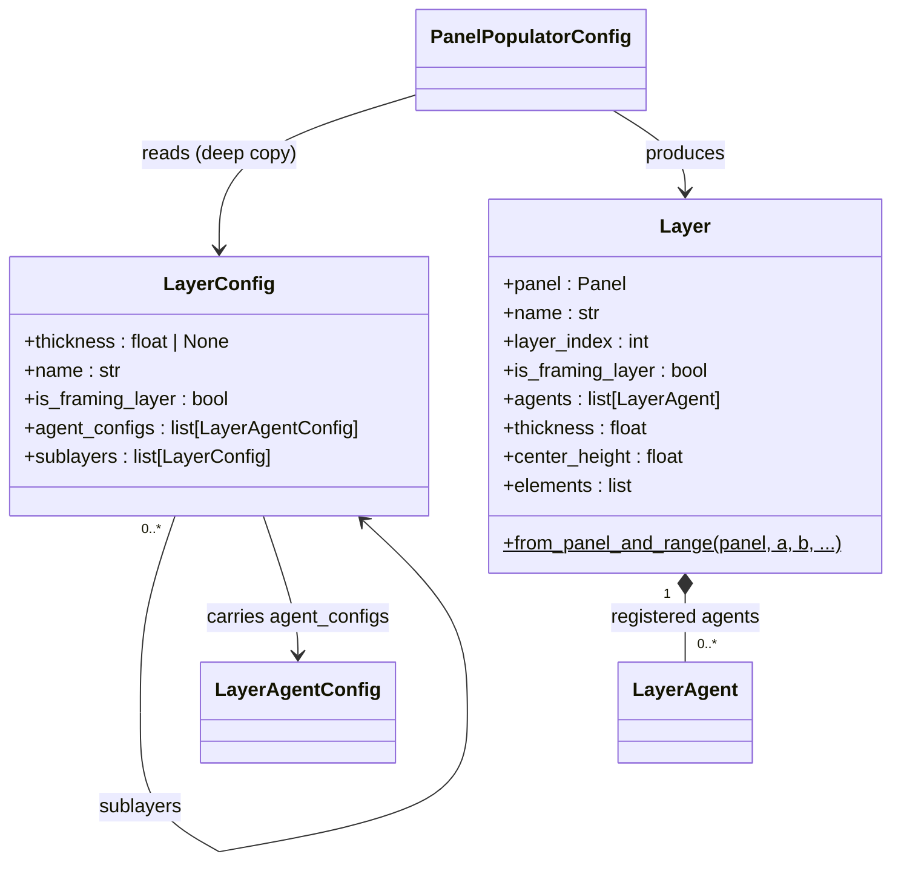
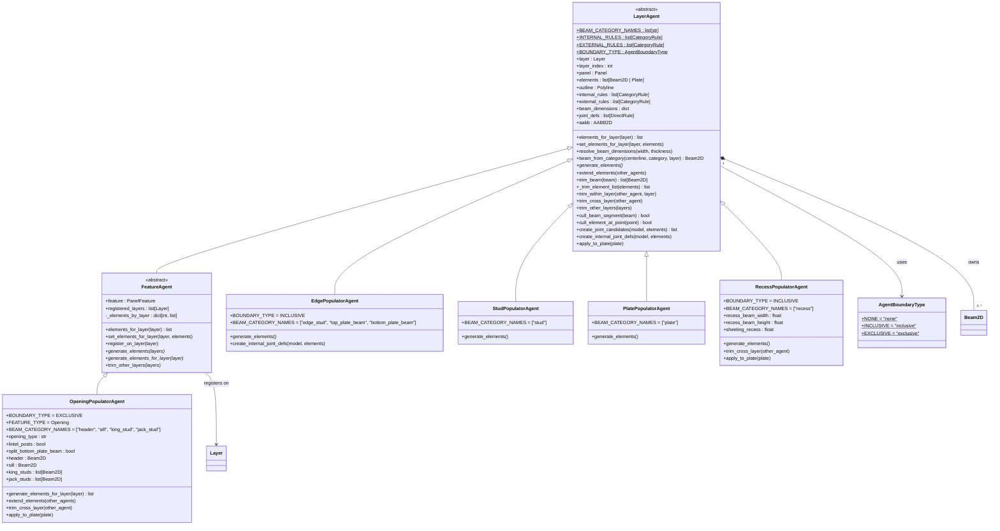
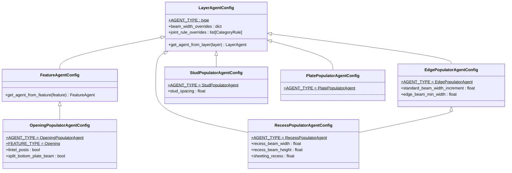
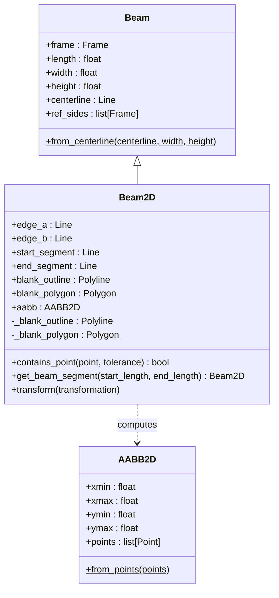
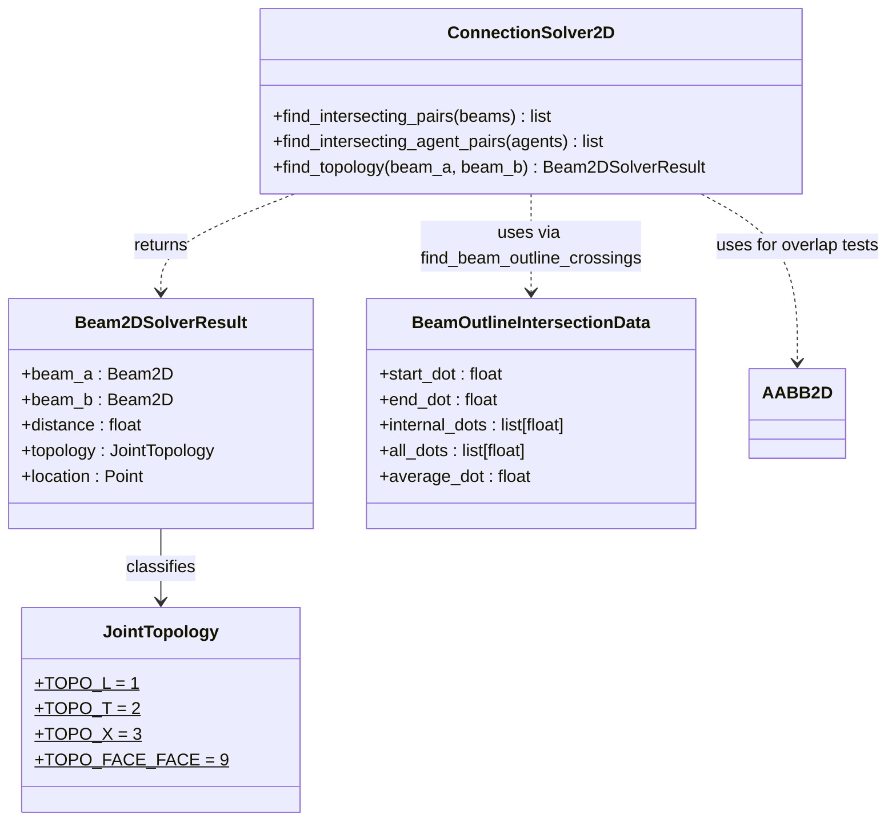

# Class Diagrams

This section provides visual representations of the class hierarchies and relationships in the `timber_design` package.

[TOC]

## Populators Subsystem

### Orchestration

`PanelPopulatorConfig` holds all parameters for one panel type, resolves the layer stack from `LayerConfig` blueprints, and produces a ready-to-use `PanelPopulator`.

---

### Populator Configs

`PanelPopulatorConfig` is a concrete base class.  Convenience subclasses
(`StudPanelPopulatorConfig`, `RecessPanelPopulatorConfig`) pre-build the
`layer_defs` list for common framing systems.  Custom configs can also be
created by instantiating `PanelPopulatorConfig` directly with a `layer_defs`
list.

---

### Layer and LayerConfig

`LayerConfig` is a pure data blueprint with no geometry.  `Layer` is the
resolved runtime object that holds geometry (a sliced panel) and the list of
agents registered on it.  The definition tree supports nested `sublayers` for
composite cross-sections; `thickness=None` on a leaf causes fill-remaining
resolution against the parent.

---

### Populator Agents

`LayerAgent` is bound to exactly one `Layer`.  `FeatureAgent` extends it for
agents that span multiple layers (e.g. openings that cut through the full panel
cross-section).  Both types expose the same `elements_for_layer` /
`set_elements_for_layer` API so the orchestrator code is uniform.

---

### Agent Configs

Each `LayerAgent` subclass has a matching config dataclass.  `FeatureAgentConfig`
adds `get_agent_from_feature` for agents that are driven by a
`PanelFeature`; it passes `layer=None` to the constructor because the agent
discovers its layers at generation time.

---

### 2D Geometry

`Beam2D` extends compas_timber's `Beam` with a lazy 2D blank outline used for
all intersection and topology detection operations. `AABB2D` is a lightweight
2D bounding box that avoids the `ZeroDivisionError` that `compas.geometry.Box`
raises on flat z=0 geometry.

---

### Connection Solver and Intersection Utilities

`ConnectionSolver2D` uses blank-outline endpoint containment to classify beam
pairs into L, T, X, or face-to-face topologies.
`BeamOutlineIntersectionData` stores the entry/exit dot positions where an
agent outline crosses a beam blank, used by `trim_beam` to split beams at
agent boundaries.

