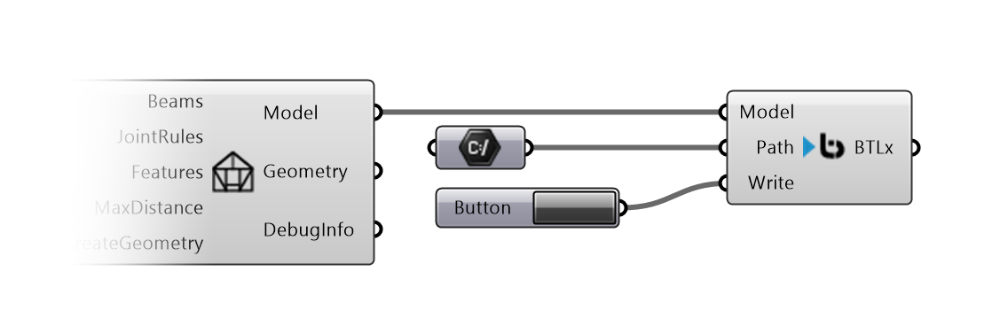

# Fabrication

Fabrication components are used to create Data for machining Compas Timber Models.

## Write BTLx

Writes a BTLx File from a Compas Timber Model.

{ width=60% }

**Inputs:**

*   `Model` : the Compas Timber Model.
*   `Path` : a `File Path` where to save the BTLx File.
*   `Write` : Writes the File if the Input is `True`.

**Outputs:**

*   `BTLx` : the BTLx Content as xml text.

!!! tip "Under the hood"
    BTLx export is done by [`compas_timber.fabrication.BTLxWriter`](https://gramaziokohler.github.io/compas_timber/latest/api/compas_timber.fabrication/).

## Nesting

**BeamStock** represents a raw material stock used for nesting beams.

**Inputs:**

*   `length` : length of the beam stock.
*   `cross_section` : values representing the cross-section dimensions of the stock.

**NestBeams** executes 1-D nesting of the model's beams into stocks, based on a given stock catalog.

**Inputs:**

*   `model` : the Compas Timber Model.
*   `stock_catalog` : a list of **BeamStock** objects defining the available stock lengths and profiles.
*   `spacing` : spacing tolerance to account for cutting operations (kerf width, etc.).
*   `fast` : if `True`, uses a faster but less optimal nesting algorithm.

**Outputs:**

*   `NestingResult` : object containing the details of the nesting operation.
*   `Summary` : a human-readable summary of the nesting result.
