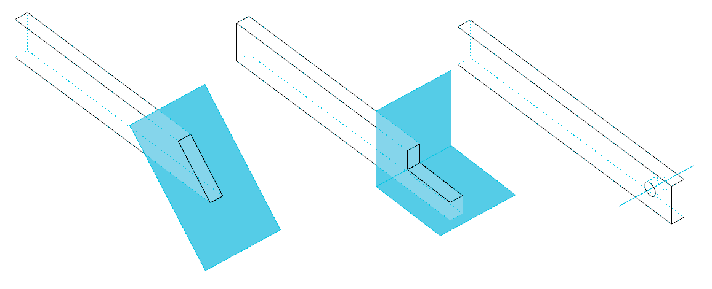
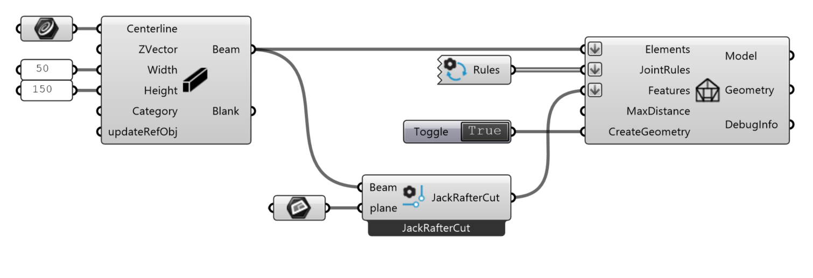
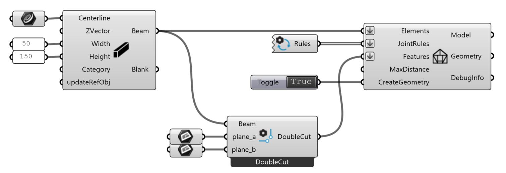
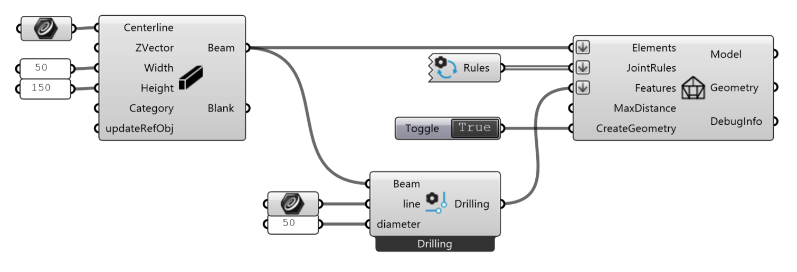

# Features

Features are additional machining operations on elements — cuts, drillings and other
[BTLx processings](https://gramaziokohler.github.io/compas_timber/latest/api/compas_timber.fabrication/):

{ width=75% }

Features are created with the **BTLx From Geometry** and **BTLx From Parameters** components.
Both output a `Feature`, which is to be used as input for the **Model** component. See [model](model.md).

## BTLx From Geometry

Generates a feature from a BTLx processing type and input geometry.

Select the processing type from the component's context menu (right click);
the component's inputs then adapt to the selected type.

**Inputs:**

*   `element` : the element(s) to apply the feature to.
*   further inputs depend on the selected processing type — for example a trimming plane, or a drilling axis line and diameter.

**Outputs:**

*   `Feature` : the feature definition, to be connected to the **Model** component's `Features` input.

Some classic examples:

**JackRafterCut** cuts an element with a plane. The part of the element lying on the *z-positive* side of the plane will be removed.

{ width=100% }

**DoubleCut** cuts an element with two planes. The part of the element lying on the *z-positive* sides of both planes will be removed.

{ width=100% }

**Drilling** subtracts a cylindrical hole from an element, defined by an axis line and a diameter.

{ width=100% }

## BTLx From Parameters

Generates a feature directly from BTLx parameters, without input geometry.

Select the processing type from the component's context menu (right click);
the component then exposes that processing's BTLx parameters as inputs.

**Inputs:**

*   `element` : the element(s) to apply the feature to.
*   `ref_side` : an integer 0–5, corresponding to BTLx reference side 1–6, on which the parameters are expressed.
*   further inputs depend on the selected processing type.

**Outputs:**

*   `Feature` : the feature definition, to be connected to the **Model** component's `Features` input.
*   `Preview` : a preview of the geometry resulting from applying the processing to the element.

## Machining Limits

**BTLxMachiningLimits** builds a machining-limits object for processings that support it
(inputs: `face_limited_start/end/front/back/top/bottom`), to be passed to **BTLx From Parameters**.

!!! tip "Under the hood"
    Each feature is a BTLx processing class in [`compas_timber.fabrication`](https://gramaziokohler.github.io/compas_timber/latest/api/compas_timber.fabrication/), for example `JackRafterCut`, `DoubleCut` and `Drilling`. Every leaf `BTLxProcessing` subclass is available in the components' context menus.
