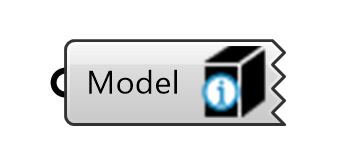
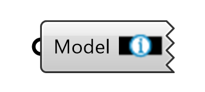
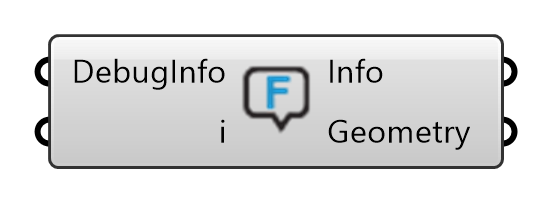
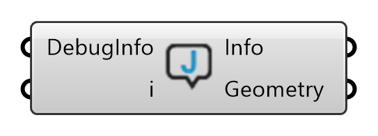
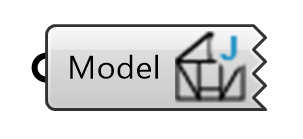
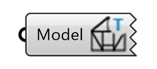

# Show

Tools for previewing, inspecting and extracting geometry and data from the model.

## Show Element Reference Sides

{ width=20% }

**Show element Reference Side** displays the sides of an element based on `ref_side_index`.
Text labels are located at the reference side origins and oriented along the reference sides.

## Show Element Index

{ width=20% }

**ShowElementIndex** displays the key of each Element in the Model.

## Show Elements By Type

**ShowElementsByType** filters element geometries by element type.

## Show Elements By Category

**ShowElementsByCategory** visualizes the elements of the model by their `Category` attribute.

## Show Feature Errors

{ width=25% }

Shows information useful for debugging feature application errors.

## Show Joining Errors

{ width=25% }

Shows information useful for debugging errors that occurred while attempting to join Beams.

## Show Joint Types

{ width=20% }

Displays the type names of each joint in the model.

## Show Topology Types

{ width=20% }

Displays the topologies (L, T or X) that Compas Timber recognizes at each Joint

## Related

**DecomposeBeam** and **FindBeamByRhinoGuid** also belong to this group — they are described in [beams](beams.md).
