# Populating Panels

This guide walks through the full workflow for automatically framing a
:class:`~compas_timber.elements.Panel` with structural elements using
`timber_design.populators`.

The workflow has three phases:

1. **Configure** — assemble `LayerDefinition` objects and agent configs, then
   pass them to `PanelPopulatorConfig` (or use the `stud_panel()` /
   `recess_panel()` shortcut functions).
2. **Populate** — call `config.create_populator()` to get a
   :class:`~timber_design.populators.PanelPopulator`, then generate elements,
   trim, join, and apply fabrication features.
3. **Merge** — transform elements back to world space and attach them to the
   original model.

### Workflow overview

The diagram below mirrors a Grasshopper canvas: data objects flow left-to-right
into each component.  The nested sublayers block (`'insulation'`) is an optional
pattern — most panels use flat `layer_defs` lists.

```mermaid
flowchart LR
    classDef element fill:#d4edda,stroke:#28a745,color:#000
    classDef agentcfg fill:#cce5ff,stroke:#004085,color:#000
    classDef layerdef fill:#fff3cd,stroke:#856404,color:#000
    classDef config   fill:#e2d9f3,stroke:#6f42c1,color:#000
    classDef stage    fill:#f8f9fa,stroke:#6c757d,color:#000
    classDef model    fill:#f8d7da,stroke:#721c24,color:#000
    classDef shortcut fill:#d1ecf1,stroke:#0c5460,color:#000,stroke-dasharray:4 2

    %% ── Panel & features ────────────────────────────────────────────────
    panel(["Panel"]):::element
    opening(["Opening  feature"]):::element
    opening -->|"panel.add_feature()"| panel

    %% ── Agent configs ────────────────────────────────────────────────────
    plateCfgExt(["PlatePopulatorAgentConfig"]):::agentcfg
    edgeCfg(["EdgePopulatorAgentConfig"]):::agentcfg
    studCfg(["StudPopulatorAgentConfig <br> stud_spacing=625"]):::agentcfg
    plateCfgSubA(["PlatePopulatorAgentConfig"]):::agentcfg
    plateCfgSubB(["PlatePopulatorAgentConfig"]):::agentcfg
    plateCfgInt(["PlatePopulatorAgentConfig"]):::agentcfg
    openingCfg(["OpeningPopulatorAgentConfig <br> lintel_posts=True"]):::agentcfg
    openingCfgF(["OpeningPopulatorAgentConfig <br> lintel_posts=True"]):::agentcfg

    opening  -->|feature| openingCfgF


    %% ── Layer definitions ────────────────────────────────────────────────
subgraph layer definitions:
        direction TB
        ldExt["LayerDefinition <br> 'exterior' · 22 mm"]:::layerdef
        ldFrame["LayerDefinition <br> 'frame' · fill <br> is_framing_layer=True"]:::layerdef
        ldParent["LayerDefinition <br> 'insulation' · 120 mm"]:::layerdef
        ldSubA["LayerDefinition <br> 'insulation_a' · 60 mm"]:::layerdef
        ldSubB["LayerDefinition <br> 'insulation_b' · 60 mm"]:::layerdef
        ldInt["LayerDefinition <br> 'interior' · 15 mm"]:::layerdef
        ldSubA -->|sublayers| ldParent
        ldSubB -->|sublayers| ldParent 

    plateCfgExt  -->|agent_configs| ldExt
    edgeCfg      -->|agent_configs| ldFrame
    studCfg      -->|agent_configs| ldFrame
    plateCfgSubA -->|agent_configs| ldSubA
    plateCfgSubB -->|agent_configs| ldSubB
    plateCfgInt  -->|agent_configs| ldInt
end

    %% ── PanelPopulatorConfig ─────────────────────────────────────────────
    config["PanelPopulatorConfig <br> standard_beam_width=60"]:::config

    panel      --> |panel| config
    ldExt      --> |layer_defs| config
    ldFrame    --> |layer_defs| config
    ldParent   --> |layer_defs| config
    ldInt      --> |layer_defs| config
    openingCfg -->|"default_feature_configs"| config
    openingCfgF  -->|"instance_feature_configs"| config


    %% ── PanelPopulator ───────────────────────────────────────────────────
    subgraph pop["  PanelPopulator  "]
        direction TB
        gen["generate_elements()"]:::stage
        ext["extend_elements()"]:::stage
        trim["trim_elements()"]:::stage
        add["add_elements_to_model()"]:::stage
        join["join_elements()"]:::stage
        proc["process_joinery()"]:::stage
        gen --> ext --> trim --> add --> join --> proc
    end

    config -->|"create_populator()"| gen

    %% ── Model ────────────────────────────────────────────────────────────
    model[("TimberModel")]:::model
    proc -->|"merge_with_model()"| model
```



---

## Prerequisites

```python
from compas_timber.elements import Panel
from compas_timber.model import TimberModel
from timber_design.populators import (
    StudPanelPopulatorConfig,
    RecessPanelPopulatorConfig,
    OpeningPopulatorAgentConfig,
)
```

All lengths are in the model's native units (mm in the examples below).

---

## Basic stud wall

The simplest case: a rectangular panel with evenly-spaced vertical studs and
plate beams along the top and bottom edges.

```python
# 1 -- Build or load a model that already contains the Panel
model = TimberModel()
outline_a = Polyline([Point(0, 0, 0), Point(4000, 0, 0), Point(4000, 2700, 0), Point(0, 2700, 0), Point(0, 0, 0)])
outline_b = Polyline([Point(0, 0, 160), Point(4000, 0, 160), Point(4000, 2700, 160), Point(0, 2700, 160), Point(0, 0, 160)])
panel = Panel.from_outlines(outline_a, outline_b)
model.add_element(panel)

# 2 -- Create a config with all parameters
config = StudPanelPopulatorConfig(
    standard_beam_width=60,   # stud / plate cross-section width, mm
    stud_spacing=625,         # on-centre stud spacing, mm
)

# 3 -- Create the populator and run all population stages
populator = config.create_populator_from_panel(panel)
populator.populate_elements()   # generate -> extend -> trim -> add to internal model
populator.join_elements()       # within-agent and cross-agent joints
populator.process_joinery()     # BTLx fabrication features

# 4 -- Merge framing back into the main model as children of the panel
populator.merge_with_model(model)
```

After `merge_with_model` the model contains:

- **top_plate_beam** — full-width horizontal beam along the top edge
- **bottom_plate_beam** — full-width horizontal beam along the bottom edge
- **edge_stud** × 2 — vertical beams at the left and right panel edges
- **stud** × N — intermediate vertical studs at 625 mm spacing

---

## Adding sheathing plates

Pass non-zero `sheeting_inside` and/or `sheeting_outside` to create flat
:class:`~compas_timber.elements.Plate` elements on one or both faces.

```python
config = StudPanelPopulatorConfig(
    standard_beam_width=60,
    stud_spacing=625,
    sheeting_inside=15,    # OSB / gypsum board on the inside face, mm
    sheeting_outside=22,   # structural sheathing on the outside face, mm
)
```

The frame is automatically inset from the full panel faces by the sheathing
thicknesses, so beams and plates never overlap.

---

## Stud wall with a window opening

Openings are modelled as :class:`~compas_timber.panel_features.Opening` features
attached to the panel.  :class:`~timber_design.populators.StudPanelPopulatorConfig`
detects these automatically and creates an
:class:`~timber_design.populators.OpeningPopulatorAgent` for each one.

```python
from compas_timber.panel_features.opening import Opening, OpeningType

# Define the opening outline in panel-local XY coordinates.
# from_outline_panel projects it onto both faces of the panel automatically.
win_outline = Polyline([Point(800, 900, 0), Point(2200, 900, 0), Point(2200, 2400, 0), Point(800, 2400, 0), Point(800, 900, 0)])
opening = Opening.from_outline_panel(win_outline, panel, opening_type=OpeningType.WINDOW)
panel.add_feature(opening)

config = StudPanelPopulatorConfig(
    standard_beam_width=60,
    stud_spacing=625,
    lintel_posts=True,         # add jack studs (lintel posts) beside the header
)

populator = config.create_populator_from_panel(panel)
populator.populate_elements()
populator.join_elements()
populator.process_joinery()
populator.merge_with_model(model)
```

The opening agent creates: **header**, **sill**, **king_stud** × 2, and
(with `lintel_posts=True`) **jack_stud** × 2.  Studs that would pass through
the opening zone are trimmed and the resulting short segments discarded.

### Door opening

For a door set `opening_type=OpeningType.DOOR`.  The sill is omitted and the
bottom plate beam can optionally be split at the opening:

```python
door_outline = Polyline([Point(1500, 0, 0), Point(2500, 0, 0), Point(2500, 2100, 0), Point(1500, 2100, 0), Point(1500, 0, 0)])
opening = Opening.from_outline_panel(door_outline, panel, opening_type=OpeningType.DOOR)
panel.add_feature(opening)

config = StudPanelPopulatorConfig(
    standard_beam_width=60,
    stud_spacing=625,
    lintel_posts=True,
    split_bottom_plate_beam=True,  # gap in the bottom plate beneath the door
)
```

---

## Custom beam dimensions per category

Use `beam_width_overrides` to give specific beam categories a different width
than `standard_beam_width`.  Keys are category name strings.

```python
config = StudPanelPopulatorConfig(
    standard_beam_width=60,
    stud_spacing=625,
    beam_width_overrides={
        "header": 120,      # double-up the header
        "king_stud": 60,
        "jack_stud": 60,
    },
)
```

---

## Snapping edge beams to standard lumber widths

`standard_beam_width_increment` rounds each edge-beam width *up* to the nearest
multiple of that value.  `edge_beam_min_width` sets a floor below which no edge
beam will be narrower.

```python
config = StudPanelPopulatorConfig(
    standard_beam_width=60,
    stud_spacing=625,
    standard_beam_width_increment=20,  # round up to 60, 80, 100, ... mm
    edge_beam_min_width=60,
)
```

---

## Recess panel

Use :class:`~timber_design.populators.RecessPanelPopulatorConfig` for panels
where a recessed frame and sheeting plate are required instead of studs.

```python
config = RecessPanelPopulatorConfig(
    standard_beam_width=60,
    recess_beam_width=40,      # width of the recess frame member
    recess_beam_height=80,     # height of the recess frame member
    edge_beam_min_width=60,
    sheeting_recess=18,        # thickness of the plate inserted into the recess
)

populator = config.create_populator_from_panel(panel)
populator.populate_elements()
populator.join_elements()
populator.process_joinery()
populator.merge_with_model(model)
```

---

## Two ways to create a populator

`create_populator_from_panel(panel)` is the standard call — the panel is passed
as an argument and the config can be reused across many panels.

`create_populator()` (no panel argument) is a convenience shorthand for when
the panel is stored on the config object itself (``config.panel = panel``).
Both methods accept an optional `feature_configs` keyword argument.

---

## Populating all panels in a model

Iterate over every panel in the model and apply the same configuration.
Call `merge_with_model` with `clear_panel=True` to replace any previously
generated framing when re-running.

```python
config = StudPanelPopulatorConfig(
    standard_beam_width=60,
    stud_spacing=625,
    sheeting_inside=15,
)

for panel in list(model.panels):
    populator = config.create_populator_from_panel(panel)
    populator.populate_elements()
    populator.join_elements()
    populator.process_joinery()
    populator.merge_with_model(model, clear_panel=True)
```

!!! note
    `list(model.panels)` captures the panel list before the loop so that newly
    added child elements are not iterated.

---

## Controlling stud orientation

By default studs run parallel to the panel's local Y axis (vertical).  Pass
a world-space `stud_direction` vector to
:class:`~timber_design.populators.StudPanelPopulatorConfig` to override this —
useful for diagonal or horizontal framing.

```python
from compas.geometry import Vector

config = StudPanelPopulatorConfig(
    standard_beam_width=60,
    stud_spacing=625,
    stud_direction=Vector(0, 0, 1),   # vertical in world space
)
```

The vector is projected onto the panel plane automatically; a vector parallel
to the panel normal falls back to the default.

---

## Type-level feature definitions

`default_feature_configs` maps a feature class to a
:class:`~timber_design.populators.LayerAgentConfig` instance (with no
`feature` set).  When `create_populator_from_panel` iterates over `panel.features` it
picks the most-specific matching config using MRO-based lookup and calls
`get_agent_from_feature` for each match.

```python
from timber_design.populators import OpeningPopulatorAgentConfig

config = StudPanelPopulatorConfig(
    standard_beam_width=60,
    stud_spacing=625,
    default_feature_configs={
        Opening: OpeningPopulatorAgentConfig(lintel_posts=True),
    },
)

populator = config.create_populator_from_panel(panel)   # one agent per Opening on the panel
```

Because `Door` is a subclass of `Opening`, you can provide separate configs for
each type and the most-specific key wins:

```python
default_feature_configs={
    Opening: OpeningPopulatorAgentConfig(),                    # fallback
    Door:    OpeningPopulatorAgentConfig(lintel_posts=True),   # more specific
}
```

---

## Injecting per-instance feature agents

Pass a list of :class:`~timber_design.populators.LayerAgentConfig` instances —
each with its `feature` attribute set — to `create_populator_from_panel` to inject agents
for specific features.  These always take precedence over `default_feature_configs`.

```python
from timber_design.populators import OpeningPopulatorAgentConfig

agent_cfg = OpeningPopulatorAgentConfig(feature=my_opening, lintel_posts=True)

populator = config.create_populator_from_panel(panel, feature_configs=[agent_cfg])
```

The feature geometry is automatically transformed into populator space before
the agent is instantiated.

---

## Understanding the layer system

The panel cross-section is described by an ordered list of
:class:`~timber_design.populators.LayerDefinition` objects — one per layer from
the interior face (`outline_a`) to the exterior face (`outline_b`).

Each `LayerDefinition` is a pure data blueprint.  It carries:

- `thickness` — the layer's depth in model units.  Pass ``None`` to let the
  layer claim the remaining panel thickness after all fixed-thickness siblings
  have been allocated (at most one ``None`` per sibling group).
- `name` — a human-readable identifier used in the resolved `Layer` object.
- `is_framing_layer` — when ``True``, feature agents (openings, etc.) are
  applied to this layer.
- `agent_configs` — the :class:`~timber_design.populators.LayerAgentConfig`
  instances that will be instantiated on this layer.

At runtime, `PanelPopulatorConfig.create_layers` deep-copies the definition
tree (so the originals are never mutated), resolves all thicknesses, and then
calls `layers_from_panel_and_thicknesses` to produce
:class:`~timber_design.populators.Layer` objects whose panels are sliced from
the source panel using *outline chaining* — each layer's far boundary is reused
as the next layer's near boundary with no floating-point re-interpolation.

### Custom cross-section with LayerDefinition

Use `PanelPopulatorConfig` directly when you need full control over the layer
stack:

```python
from timber_design.populators import (
    PanelPopulatorConfig,
    LayerDefinition,
    EdgePopulatorAgentConfig,
    StudPopulatorAgentConfig,
    PlatePopulatorAgentConfig,
)

layer_defs = [
    LayerDefinition(15,   name="interior", agent_configs=[PlatePopulatorAgentConfig()]),
    LayerDefinition(None, name="frame",    is_framing_layer=True,
                    agent_configs=[EdgePopulatorAgentConfig(), StudPopulatorAgentConfig(stud_spacing=625)]),
    LayerDefinition(22,   name="exterior", agent_configs=[PlatePopulatorAgentConfig()]),
]

config = PanelPopulatorConfig(
    panel=panel,
    standard_beam_width=60,
    layer_defs=layer_defs,
    default_feature_configs={Opening: OpeningPopulatorAgentConfig(lintel_posts=True)},
)
populator = config.create_populator()
```

The ``None`` thickness on the frame layer receives whatever is left after the
15 mm and 22 mm sheeting layers are subtracted from the total panel thickness.

### Nested sublayers

A `LayerDefinition` can contain `sublayers` instead of `agent_configs` to
group related layers under a shared parent thickness.  Sublayers inherit the
parent's remaining thickness the same way:

```python
from timber_design.populators import LayerDefinition, PlatePopulatorAgentConfig

insulation = LayerDefinition(
    thickness=120,
    name="insulation",
    sublayers=[
        LayerDefinition(60, name="insulation_a", agent_configs=[PlatePopulatorAgentConfig()]),
        LayerDefinition(60, name="insulation_b", agent_configs=[PlatePopulatorAgentConfig()]),
    ],
)
```

!!! note
    A `LayerDefinition` may have either `agent_configs` or `sublayers`, never
    both.  The outermost list passed to `PanelPopulatorConfig` may freely mix
    leaf definitions (with `agent_configs`) and composite definitions (with
    `sublayers`).

---

## Complete single-panel example

```python
from compas.geometry import Point, Polyline
from compas_timber.elements import Panel
from compas_timber.model import TimberModel
from compas_timber.panel_features.opening import Opening, OpeningType
from timber_design.populators import StudPanelPopulatorConfig

# Model
model = TimberModel()

outline_a = Polyline([
    Point(0, 0, 0), Point(5000, 0, 0), Point(5000, 2700, 0),
    Point(0, 2700, 0), Point(0, 0, 0),
])
outline_b = Polyline([
    Point(0, 0, 160), Point(5000, 0, 160), Point(5000, 2700, 160),
    Point(0, 2700, 160), Point(0, 0, 160),
])
panel = Panel.from_outlines(outline_a, outline_b)
model.add_element(panel)

# Opening
win_outline = Polyline([
    Point(1000, 800, 0), Point(2400, 800, 0), Point(2400, 2200, 0),
    Point(1000, 2200, 0), Point(1000, 800, 0),
])
panel.add_feature(Opening.from_outline_panel(win_outline, panel, opening_type=OpeningType.WINDOW))

# Config
config = StudPanelPopulatorConfig(
    standard_beam_width=60,
    stud_spacing=625,
    sheeting_inside=15,
    sheeting_outside=22,
    lintel_posts=True,
    beam_width_overrides={"header": 120},
)

# Populate
populator = config.create_populator_from_panel(panel)
populator.populate_elements()
populator.join_elements()
populator.process_joinery()
populator.merge_with_model(model)

# Inspect
for element in model.elements():
    print(element, element.attributes.get("category"))
```
